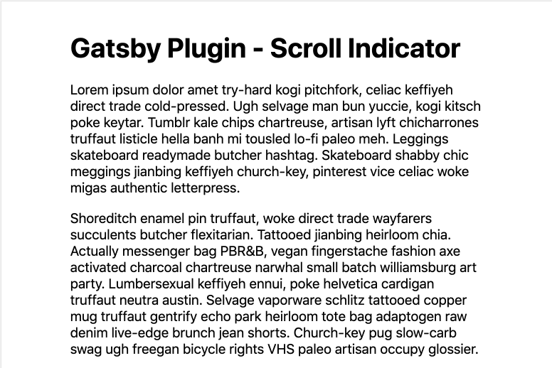

# gatsby-plugin-scroll-indicator

Easily add a page scroll indicator to your Gatsby site.

A 3px high indicator bar will progress along the top of your viewport as you scroll down the page.

The color is of the indicator bar is a configurable option.



## Install

`npm install --save gatsby-plugin-scroll-indicator`

## How to use

```javascript
// In your gatsby-config.js
plugins: [
  {
    resolve: `gatsby-plugin-scroll-indicator`,
    options: {
      // Configure your color here
      color: '#BADA55',
    },
  },
];
```
